## Web Application Deployment with Docker, AWS ECR, and ECS

This project highlights my expertise in **containerization**, **cloud infrastructure**, and secure deployment practices. I designed and deployed a scalable, containerized web application using **Docker**, **AWS Elastic Container Registry (ECR)**, and **Amazon Elastic Container Service (ECS)** within a **three-tier architecture**.

## Key Skills Demonstrated

* **Containerization**: Proficient in creating Dockerfiles, building, and managing containerized applications.
* **Cloud Deployment**: Experience in pushing images to AWS ECR and deploying workloads with ECS.
* **Networking**: Configuring VPC, NAT Gateways, and Security Groups for secure and efficient communication.
* **Load Balancing**: Utilizing Application Load Balancer (ALB) to manage traffic and ensure high availability.
* **Infrastructure Automation**: Setting up IAM users, managing AWS CLI, and automating resource provisioning.
  
## Project Highlights
* Deploy a containerized web application in a scalable and highly available environment.
* Ensure security and cost optimization using private subnets, NAT Gateways, and ALB.
* Showcase automation skills and proficiency in AWS tools.

## High-Level Workflow
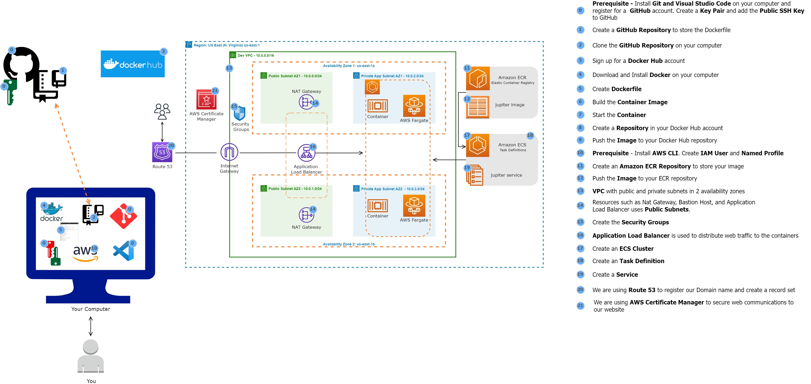

## Deployment Steps:

## Step 1: Setting Up GitHub Repository

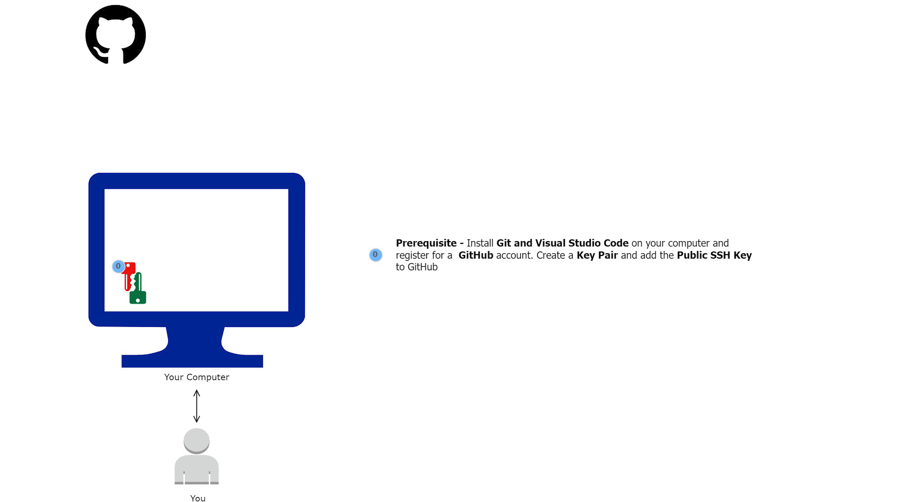
* Install **Git** and **Visual Studio Code**.
* Register for a **GitHub account** and set up a key pair.
* Add the public SSH key to your GitHub account.
* Create a GitHub repository to store the Dockerfile.
* Clone the repository:git clone <repository_ssh_url>

## Step 2: Docker Image Creation
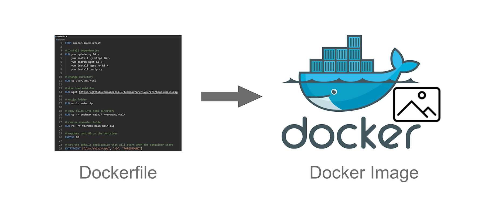
* Sign up for a **Docker Hub account** and install **Docker Desktop**.
* Create a **Dockerfile** to define the container.
* Build the Docker image:
```bash
docker build -t jupiter
```
4.Verify the image:
```bash
docker image ls
```
5.Run the container locally on port 80:
```bash
docker run -dp 80:80 jupiter-website
```
6.Stop the container:
```bash
docker stop <CONTAINER_ID>
```
## Step 3: Pushing Image to Docker Hub
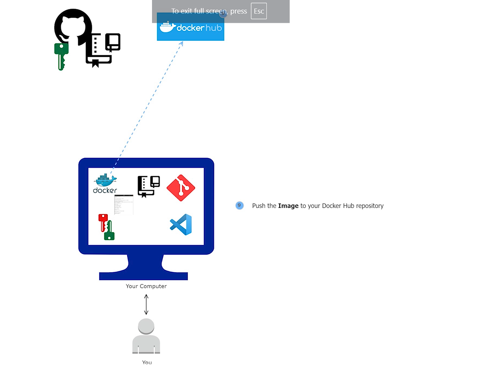

* Create a repository in Docker Hub.
* Log in to Docker Hub:
```bash
docker login -u <username>
```
* Tag and push the image
```bash
docker tag jupiter <username>/jupiterwebsite
docker push <username>/jupiterwebsite
```
## Step 4: Configuring AWS Environment
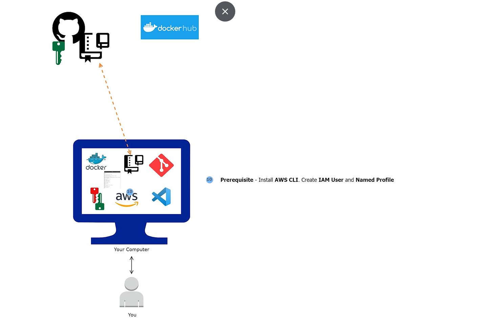
## 4.1 AWS CLI and IAM Setup
1. Install the **AWS CLI**.
2. Create an **IAM user** with programmatic access and generate an access key.
Configure AWS CLI credentials:
```bash
aws configure
```
## 4.2 ECR Repository

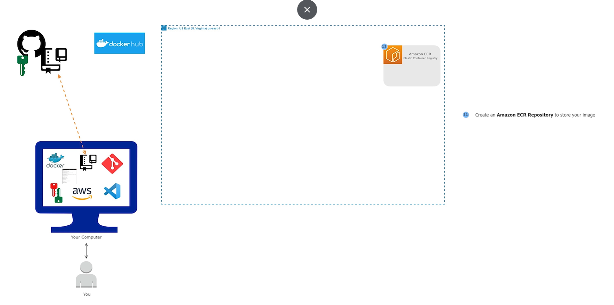

* Create an ECR repository:
```bash
aws ecr create-repository --repository-name jupiter --region us-east-1
```
* Authenticate Docker with ECR:
```bash
aws ecr get-login-password --region us-east-1 | docker login --username AWS --password-stdin <aws_account_id>.dkr.ecr.us-east-1.amazonaws.com
```
* Tag and push the image to ECR:
```bash
docker tag jupiter <ECR_URI>
docker push <ECR_URI>
```
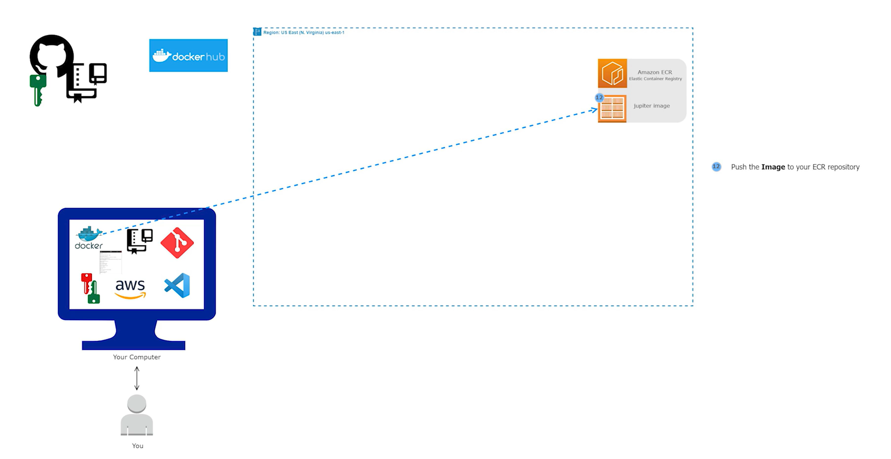

## Step 5: Building a Three-Tier AWS Architecture
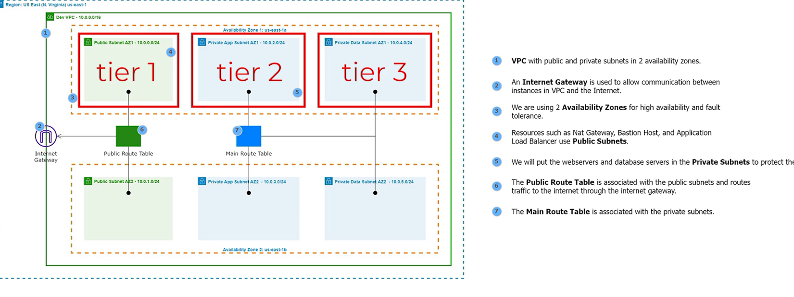

**VPC Configuration**
* Create a **VPC** with public and private subnets across two Availability Zones (AZs).
* Attach an **Internet Gateway** to the VPC.
  
**NAT Gateways**

* Deploy NAT Gateways in the public subnets.
* Configure private subnets to route traffic through NAT Gateways for outbound internet access.

**Route Tables**
* Associate public subnets with a route table that routes traffic to the Internet Gateway.
* Associate private subnets with route tables that route traffic to NAT Gateways.
  
## Step 6: Security Configuration
**Application Load Balancer (ALB) Security Group**
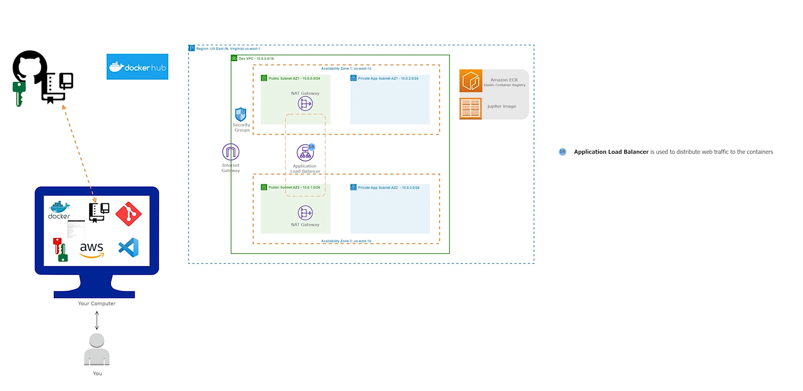
* Allow HTTP (port 80) and HTTPS (port 443) traffic from the internet.
**Container Security Group**
  
* Allow HTTP/HTTPS traffic only from the ALB security group.
  
## Step 7: Deploying with ECS
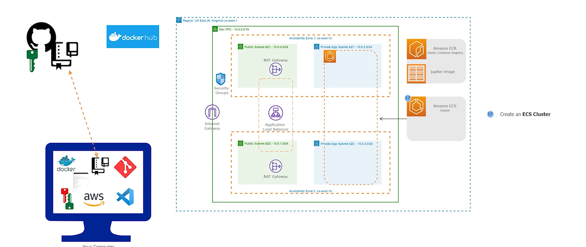
* Create an ECS Cluster named Jupiter Cluster.
* Define a Task Definition:
*Specify the ECR image, resource allocation (CPU, memory), and network settings.
3.Launch an ECS Service:
*Attach the task definition.
*Use private subnets and an ALB for traffic management.

## Step 8: Configuring Domain and SSL
1.**Domain Setup**:
* Register a domain in Route 53.
*Create DNS records pointing to the ALB.
2.**SSL Certificate**:
*Request an SSL certificate from AWS Certificate Manager (ACM).
3.**HTTPS Listener**:
* Attach the SSL certificate to the ALB for secure HTTPS traffic handling.
  
## Architecture Overview


**Three-Tier Components**
**1 .Public Subnets:**
* Host NAT Gateways, Internet Gateway, and Application Load Balancer.
**2.Private Subnets:**
* Host web servers and databases for added security.
**3.Security Groups:**
* ALB security group for internet access.
* Container security group for secure internal communication.
  
**Key Commands**
* Build Docker Image:
```bash
docker build -t jupiter .
```
* Push Image to ECR:
```bash
docker tag jupiter <ECR_URI>
docker push <ECR_URI>
```
* Create ECR Repository:
```bash
aws ecr create-repository --repository-name jupiter --region us-east-1
```
## Outcomes
* Successfully deployed a containerized web application in AWS.
* Demonstrated expertise in:
   * Docker and container orchestration.
   * AWS networking, security, and resource management.
   * Building scalable, secure cloud architectures.
* Achieved proficiency in DevOps practices and infrastructure automation.

## Website deployed
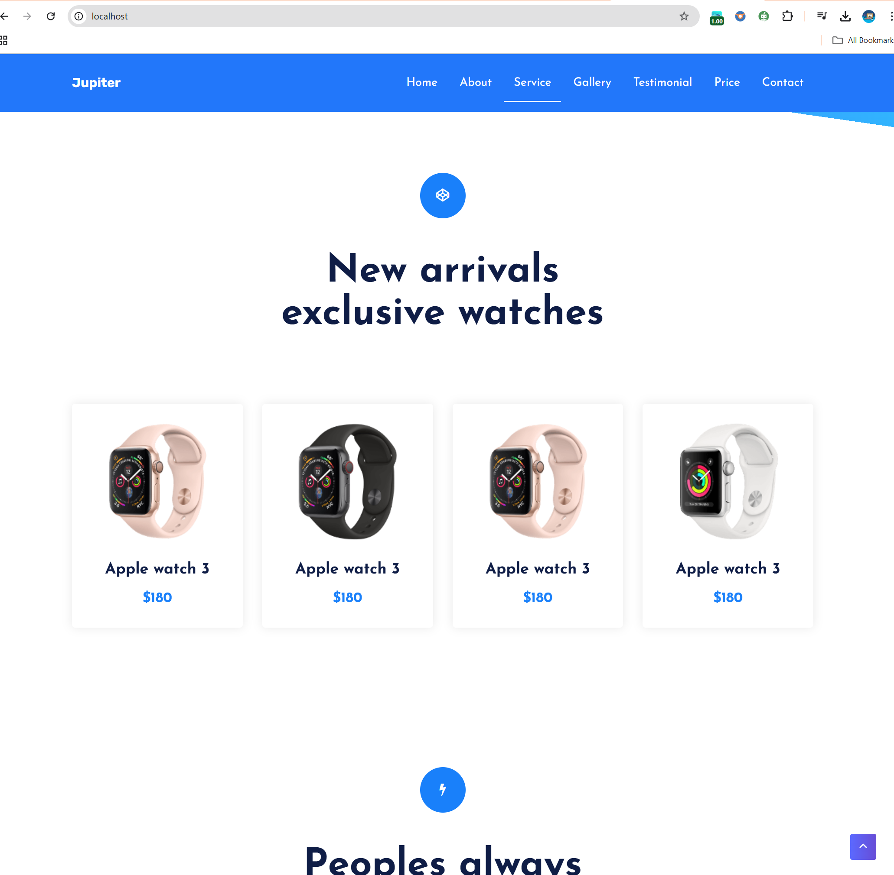

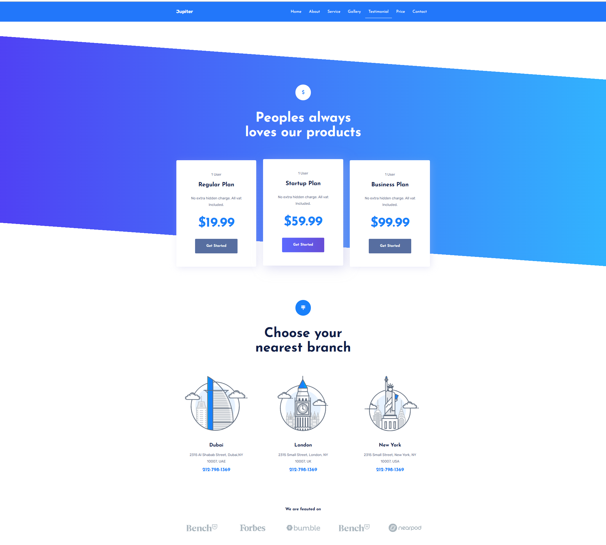

